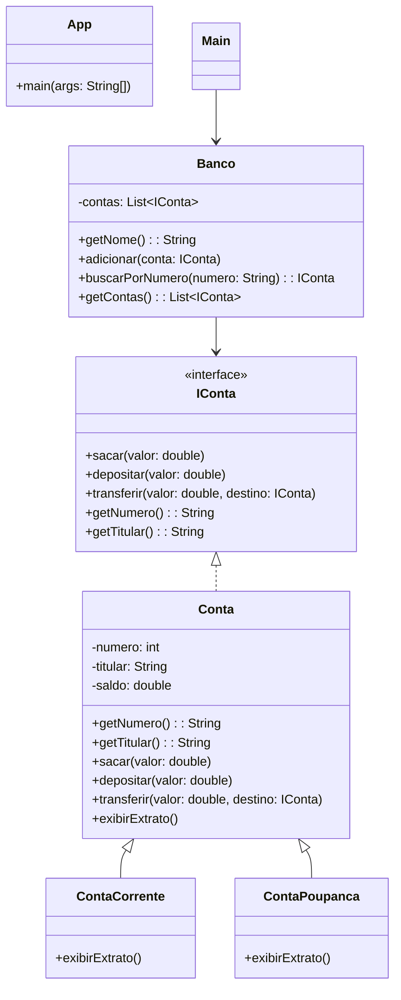

# 💳 Banco Digital em Java

Este é um projeto de estudo que simula um **banco digital**, criado com Java utilizando os princípios da **Programação Orientada a Objetos (POO)** e arquitetura em camadas. Desenvolvido por **Raes** como forma de aprendizado prático.

## 🧠 Conceitos Aplicados

- **Abstração:** Representação conceitual das entidades bancárias.
- **Encapsulamento:** Controle de acesso e proteção dos dados.
- **Herança:** Contas específicas herdam comportamentos de uma classe genérica.
- **Polimorfismo:** Utilização de interface para generalizar o tratamento das contas.
- **Estrutura em camadas**: ajuda a manter o código bem organizado

## 🔍 Explicando as camadas:

- src/app/ → Contém a interface com o usuário, normalmente com um App.java para testes e simulações.

- src/banco/model/ → Contém as classes e interfaces do domínio (modelo de conta).

- src/banco/service/ → Lógica de negócio, como ContaServico, que orquestra saques, depósitos e transferências.

Essa estrutura ajuda a manter o código bem organizado e preparado para evoluir, por exemplo, se quiser adicionar uma interface gráfica, persistência real com banco de dados, ou testes automatizados.

## 🧱 Estrutura do Projeto
````
📦 banco-digital/
    ├──📁 src/
    |   ├──📁 application/
    |   |   └── 📄 App.java
    |   └──📁 banco/
    |       ├──📁 model/
    |       |   ├── 📄 Banco.java
    |       |   ├── 📄 Cliente.java
    |       |   ├── 📄 Conta.java
    |       |   ├── 📄 ContaCorrente.java
    |       |   ├── 📄 ContaPoupanca.java
    |       |   └── 📄 IConta.java
    |       ├──📁 service/
    |       └── 📄 ContaServico.java
    |   
    ├── 📄 .gitignore
    └── 📄 README.md
         
````

## 🎨 Diagrama UML (Mermaid)

## 🛠️ Tecnologias

- Java 21
- VS Code
- Paradigma de Programação Orientada a Objetos
- Diagramação com Mermaid Markdown

## 👤 Autor

Desenvolvido por **raesbyt**, com apoio educacional da [DIO](https://dio.me).  
Se quiser me acompanhar ou contribuir, fique à vontade para visitar meu GitHub!

📄 Licença
Este projeto está licenciado sob a MIT License.


